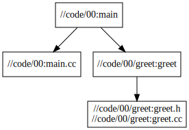

# Build C++20 with Bazel and Clang

> Ubuntu 20

## Requirements

- [Bazel](https://bazel.build/) build system
- [LLVM](https://llvm.org/) Clang compiler
  - [Clang](https://clang.llvm.org/) is an "LLVM native" C/C++/Objective-C compiler

### Install Bazel

[Bazelisk](https://github.com/bazelbuild/bazelisk) is the recommended way to install Bazel, we install its [binary release](https://github.com/bazelbuild/bazelisk/releases):

```bash
cd ~
wget https://github.com/bazelbuild/bazelisk/releases/download/v1.12.0/bazelisk-linux-amd64 -O bazelisk-1.12.0-linux-amd64
chmod a+x bazelisk-*

sudo ln -s $(pwd)/bazelisk-1.12.0-linux-amd64 /usr/local/bin/bazel

touch WORKSPACE
# could not resolve the version 'latest' to an actual version number
#  https://github.com/bazelbuild/bazelisk/issues/220
cat <<-EOF > .bazeliskrc
BAZELISK_BASE_URL=https://github.com/bazelbuild/bazel/releases/download
USE_BAZEL_VERSION=5.2.0
EOF

bazel version
```

For more ways, see [the official doc](https://bazel.build/install). Furthermore, [buildtools](https://github.com/bazelbuild/buildtools/releases) are recommended to install.

<!--
sudo ln -s $(pwd)/buildifier-5.1.0-linux-amd64 /usr/local/bin/buildifier
sudo ln -s $(pwd)/buildozer-5.1.0-linux-amd64 /usr/local/bin/buildozer
-->

Get started to build a C++ Project, see my [start bazel](../tutorials/start-bazel/README.md).

### Install LLVM from Source

About `std::fromat` text formatting:

> The paper is implemented but still marked as an incomplete feature (the feature-test macro is not set and the libary is only available when built with LIBCXX_ENABLE_INCOMPLETE_FEATURES). Not yet implemented LWG-issues will cause API and ABI breakage.

- [C++ compiler support](https://en.cppreference.com/w/cpp/compiler_support)
- [libc++ C++20 Status](https://libcxx.llvm.org/Status/Cxx20.html)

Thus, we build it from source.

- [Building Clang](https://clang.llvm.org/get_started.html)
- [Building libc++](https://libcxx.llvm.org/BuildingLibcxx.html)

```bash
git clone -b llvmorg-14.0.6 --depth 1 https://github.com/llvm/llvm-project.git

cd llvm-project
mkdir _build
cd _build

# llvm install path, such as /usr/local/llvm
LLVM_PREFIX=$HOME/Apps/llvm-14.0.6

cmake -DCMAKE_BUILD_TYPE=Release \
-DCMAKE_INSTALL_PREFIX=$LLVM_PREFIX \
-DLLVM_ENABLE_PROJECTS=clang \
-DLLVM_ENABLE_RUNTIMES="libcxx;libcxxabi" \
-DLIBCXX_ENABLE_INCOMPLETE_FEATURES=ON \
../llvm

make -j`nproc`
make install

sudo ln -s $LLVM_PREFIX /usr/local/llvm

cat <<-EOF >> ~/.bashrc
# llvm
export LLVM_HOME=/usr/local/llvm
export PATH=\$LLVM_HOME/bin:\$PATH
export LD_LIBRARY_PATH=\$LLVM_HOME/lib/x86_64-unknown-linux-gnu:\$LD_LIBRARY_PATH
EOF

llvm-config --version
clang --version
```

Test:

```bash
cat <<-EOF > hello.cc
#include <format>
#include <iostream>

int main() {
  std::string message = std::format("The answer is {}.", 42);
  std::cout << message << std::endl;
}
EOF

clang++ -std=c++20 -stdlib=libc++ hello.cc -o hello

./hello
```

### Install LLVM from Binary (Unused in this project)

Way 1. install its [binary release](https://github.com/llvm/llvm-project/releases)

```bash
cd ~
wget https://github.com/llvm/llvm-project/releases/download/llvmorg-13.0.0/clang+llvm-13.0.0-x86_64-linux-gnu-ubuntu-20.04.tar.xz
tar -xf clang+llvm-*.tar.xz

sudo ln -s $(pwd)/clang+llvm-13.0.0-x86_64-linux-gnu-ubuntu-20.04 /usr/local/llvm

cat <<-EOF >> ~/.bashrc
# llvm
export LLVM_HOME=/usr/local/llvm
export PATH=\$LLVM_HOME/bin:\$PATH
EOF

llvm-config --version
clang --version
```

Way 2. install using `apt`: https://apt.llvm.org/

Way 3. install using [LLVM toolchain for Bazel](https://github.com/grailbio/bazel-toolchain)

## Configure Clang Toolchain

We follow the [Bazel Tutorial: Configure C++ Toolchains](https://bazel.build/tutorials/cc-toolchain-config), finally the following files will be created:

- [WORKSPACE](../WORKSPACE)
- [.bazelrc](../.bazelrc)
- [toolchain/BUILD](../toolchain/BUILD)
- [toolchain/cc_toolchain_config.bzl](../toolchain/cc_toolchain_config.bzl)

## Build the C++20 Application

Coding:

- code/00/
  - [main.cc](../code/00/main.cc)
  - [BUILD](../code/00/BUILD)
  - [greet/greet.h](../code/00/greet/greet.h)
  - [greet/greet.cc](../code/00/greet/greet.cc)
  - [greet/BUILD](../code/00/greet/BUILD)

Build:

```bash
bazel build --config=clang_config //code/00:main
```

Run:

```bash
$ bazel-bin/code/00/main
Hello world!
{}  : alpha
{} {}  : alpha Z
{} {} {}  : alpha Z 3.14
```

View deps:

```bash
sudo apt update && sudo apt install graphviz xdot -y
# view
xdot <(bazel query --notool_deps --noimplicit_deps "deps(//code/00:main)" --output graph)
# to svg
dot -Tsvg <(bazel query --notool_deps --noimplicit_deps "deps(//code/00:main)" --output graph) -o 00_main.svg
```



## References

- Bazel Tutorial
  - [Configure C++ Toolchains](https://bazel.build/tutorials/cc-toolchain-config)
  - [Build a C++ Project](https://bazel.build/tutorials/cpp)
- Bazel Issue
  - [Support C++20 modules #4005](https://github.com/bazelbuild/bazel/issues/4005)
- Project Example
  - [How to Use C++20 Modules with Bazel and Clang](https://buildingblock.ai/cpp20-modules-bazel)
  - [bazel-cpp20: Template for bazel with C++20](https://github.com/jwmcglynn/bazel-cpp20)
  - [Clang toolchain](https://github.com/hlopko/clang_toolchain)
