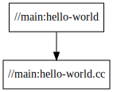
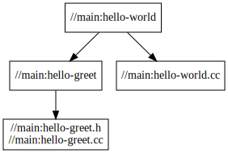
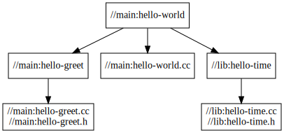

# Start Bazel for a C++ Project

- [Bazel Tutorial: Build a C++ Project](https://bazel.build/tutorials/cpp)
  - [Install Bazel](https://bazel.build/install)
  - [Examples to build C++ code](https://github.com/bazelbuild/examples/tree/main/cpp-tutorial)
  - [Common C++ Build Use Cases](https://bazel.build/tutorials/cpp-use-cases)
- [Bazel Tutorial: Configure C++ Toolchains](https://bazel.build/tutorials/cc-toolchain-config)

```bash
git clone --depth 1 https://github.com/bazelbuild/examples
```

## Stage 1

The first stage is really simple and shows you how to compile a binary with a single source file.

```bash
$ cd examples/cpp-tutorial/stage1

$ cat <<-EOF > .bazeliskrc
BAZELISK_BASE_URL=https://github.com/bazelbuild/bazel/releases/download
USE_BAZEL_VERSION=5.2.0
EOF

$ cat main/BUILD
load("@rules_cc//cc:defs.bzl", "cc_binary")

cc_binary(
    name = "hello-world",
    srcs = ["hello-world.cc"],
)
```

Build:

```bash
$ bazel build //main:hello-world
Starting local Bazel server and connecting to it...
INFO: Analyzed target //main:hello-world (37 packages loaded, 161 targets configured).
INFO: Found 1 target...
Target //main:hello-world up-to-date:
  bazel-bin/main/hello-world
INFO: Elapsed time: 6.051s, Critical Path: 0.20s
INFO: 6 processes: 4 internal, 2 linux-sandbox.
INFO: Build completed successfully, 6 total actions
```

Run:

```bash
$ bazel-bin/main/hello-world
Hello world
Sat Jul  2 07:00:00 2022
```

Get deps graph:

```bash
$ bazel query --notool_deps --noimplicit_deps "deps(//main:hello-world)" --output graph
digraph mygraph {
  node [shape=box];
  "//main:hello-world"
  "//main:hello-world" -> "//main:hello-world.cc"
  "//main:hello-world.cc"
}
Loading: 1 packages loaded
```

View text by [GraphViz](http://www.webgraphviz.com/), or locally by:

```bash
sudo apt update && sudo apt install graphviz xdot
# view
xdot <(bazel query --notool_deps --noimplicit_deps "deps(//main:hello-world)" --output graph)
# to svg
dot -Tsvg <(bazel query --notool_deps --noimplicit_deps "deps(//main:hello-world)" --output graph) -o out.svg
```



## Stage 2

The second stage will showcase how to build an application with multiple source and header files, separated in a library and a binary.

```bash
$ cd examples/cpp-tutorial/stage2

$ cat <<-EOF > .bazeliskrc
BAZELISK_BASE_URL=https://github.com/bazelbuild/bazel/releases/download
USE_BAZEL_VERSION=5.2.0
EOF

$ cat main/BUILD
load("@rules_cc//cc:defs.bzl", "cc_binary", "cc_library")

cc_library(
    name = "hello-greet",
    srcs = ["hello-greet.cc"],
    hdrs = ["hello-greet.h"],
)

cc_binary(
    name = "hello-world",
    srcs = ["hello-world.cc"],
    deps = [
        ":hello-greet",
    ],
)
```

Build & run:

```bash
$ bazel build //main:hello-world

$ bazel-bin/main/hello-world
Hello world
Sat Jul  2 07:00:00 2022
```

View deps:

```bash
xdot <(bazel query --notool_deps --noimplicit_deps "deps(//main:hello-world)" --output graph)
```



## Stage 3

The third stage showcases how to link multiple build directories by building multiple libraries in different packages and then connecting it up with the main application.

```bash
$ cd examples/cpp-tutorial/stage3

$ cat <<-EOF > .bazeliskrc
BAZELISK_BASE_URL=https://github.com/bazelbuild/bazel/releases/download
USE_BAZEL_VERSION=5.2.0
EOF

$ cat lib/BUILD
load("@rules_cc//cc:defs.bzl", "cc_library")

cc_library(
    name = "hello-time",
    srcs = ["hello-time.cc"],
    hdrs = ["hello-time.h"],
    visibility = ["//main:__pkg__"],
)

$ cat main/BUILD
load("@rules_cc//cc:defs.bzl", "cc_binary", "cc_library")

cc_library(
    name = "hello-greet",
    srcs = ["hello-greet.cc"],
    hdrs = ["hello-greet.h"],
)

cc_binary(
    name = "hello-world",
    srcs = ["hello-world.cc"],
    deps = [
        ":hello-greet",
        "//lib:hello-time",
    ],
)
```

Build & run:

```bash
$ bazel build //main:hello-world

$ bazel-bin/main/hello-world
Hello world
Sat Jul  2 07:00:00 2022
```

View deps:

```bash
xdot <(bazel query --notool_deps --noimplicit_deps "deps(//main:hello-world)" --output graph)
```


